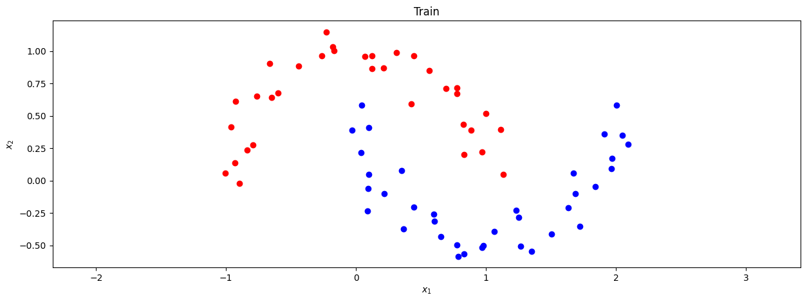
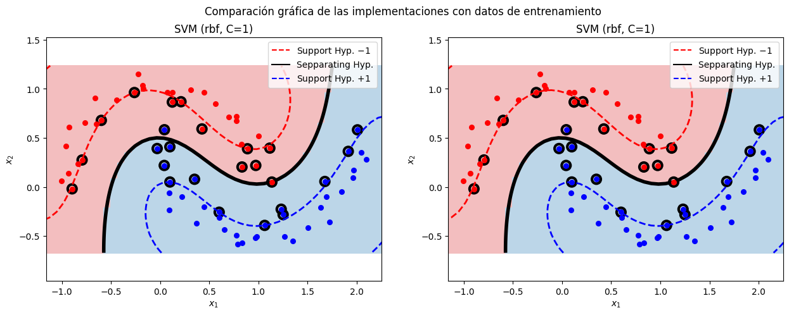

# SMO for SVM Implementation

This project presents an implementation of the Sequential Minimal Optimization (SMO) algorithm to solve the dual optimization problem of the Soft-Margin Support Vector Machine (SVM). The SMO algorithm utilizes a divide-and-conquer approach to efficiently tackle the quadratic programming problem inherent in SVM training.

## Key Concepts of SMO algorithm:

1. **Dual Optimization Problem**:
   - The SMO algorithm addresses the dual optimization problem of the SVM, aiming to maximize a quadratic function subject to linear constraints.

2. **Sequential Pairwise Optimization**:
   - SMO iteratively selects pairs of Lagrange multipliers to optimize, solving for two variables at a time while holding others constant. This simplifies the optimization process into manageable sub-problems.

3. **Analytical Solution**:
   - For each pair of selected multipliers, the algorithm computes the optimal values analytically, ensuring that the constraints are satisfied.

4. **KKT Conditions**:
   - SMO checks the Karush-Kuhn-Tucker (KKT) conditions to determine which multipliers need optimization, guiding the convergence towards the optimal solution.

5. **Efficiency**:
   - By focusing on two variables at a time, SMO significantly reduces the computational complexity compared to traditional quadratic programming methods, making it suitable for large datasets.

## Self Implementation vs. Sklearn Implementation

Both implementations demonstrate comparable performance in the classification task.

- **Data Visualization:**  
  

- **Performance Evaluation:**
  1. **Comparison of Decision Function Scores:**
     - Identical: False
     - Similarity (abs(diff) < 0.05): True
  2. **Comparison of Predicted Classes:**
     - Identical: True
  3. **Metrics:**
     - Sklearn Implementation:
       - Accuracy: 0.966667
       - AUC: 0.995536
     - My Implementation:
       - Accuracy: 0.966667
       - AUC: 0.995536

### Analysis of Comparison of Decision Function Scores:
In the preceding point 1, we juxtapose the results between the Sklearn implementation and the one provided in this document. Despite not being identical, we observe a level of similarity. This disparity arises from potential differences in the parameters (e.g., alphas, b) and hyperparameters chosen during iterations compared to those in the Sklearn implementation. However, they still exhibit considerable resemblance within a specified tolerance (in this case, 0.05).

### Analysis of Comparison of Predicted Classes:
Upon comparing the predicted labels by the model, we find them to be precisely identical, despite the differences in decision function scores. This consistency stems from the equally effective selection of parameters during the SMO process, thereby ensuring accurate predictions, as corroborated by the metrics.
  

